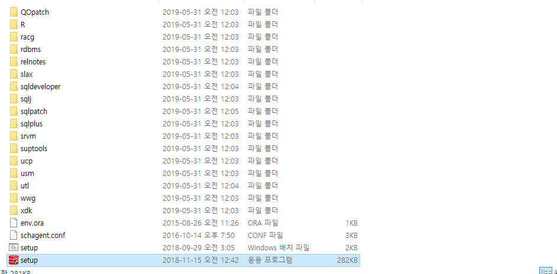

## 오라클 DB 설치방법
1. 오라클 사이트 접속
    - [오라클](https://www.oracle.com/kr/database/technologies/oracle-database-software-downloads.html)

2. 자신의 운영체제에 맞는 버전 설치하기
    - 본인의 경우 19c 윈도우 64bit 버전 설치

3. C 드라이브의 oracle 폴더 하나 만들어주기.

4. oracle 폴더에 다운받은 Oracel Database 19c 의 압축 파일을 풀기.

5. 압축을 풀고나면 나오는 파일안의 setup.exe 폴더 관리자 권한으로 실행 (중요)
    <!-- -  -->
    - 

